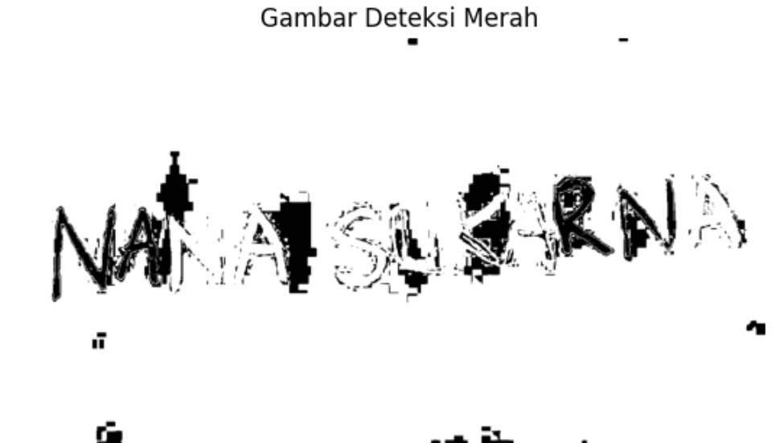

# PCD_UTS_202231502_2024_ITPLN

Repo ini merupakan repository untuk mngerjakan UTS matkul Pengolahan Citr Digital ITPLN 2024 dimana tugasnya membuat projeck deteksi warna pada citra

## 1 DETEKSI WARNA HIJAU, MERAH, BIRU

### SOURCE CODE DAN LANGKAH - LANGKAH

- Langkah pertama import semua library nya terlebih dahulu
  import cv2
  import numpy as np
  import matplotlib.pyplot as plt

- Penjelasan ketiga library tersebut- OpenCv(cv2)

  - OpenCV(cv2) = library open-source yang berfokus pada pemrosesan gambar dan penglihatan komputer.OpenCV digunakan untuk berbagai tugas seperti deteksi objek, segmentasi gambar, pencocokan pola, pemrosesan video, dan banyak lagi.

  - Matplotlib = library Python yang kuat untuk membuat visualisasi data seperti grafik, plot, histogram, dan sebagainya, library ini cocok digunakan untuk eksplorasi data, analisis data, dan menyajikan hasil secara visual.

  - NumPy (Numerical Python) :library Python yang memberikan dukungan untuk operasi matematika pada array dan matriks multidimensi, library ini menyediakan fungsi- fungsi untuk operasi matematika dasar seperti penjumlahan, pengurangan, perkalian, pembagian, dan fungsi-fungsi lain.

- Selanjutnya Baca Imagenya

  image_path = 'nana.jpeg': Mendefinisikan variabel image_path yang berisi path atau lokasi dari gambar yang ingin dibaca.

  image = cv2.imread(image_path): Menggunakan fungsi cv2.imread() dari library OpenCV untuk membaca gambar dari path yang telah ditentukan sebelumnya (image_path). Hasil dari fungsi ini adalah representasi gambar dalam bentuk matriks piksel. Variabel image akan menyimpan matriks tersebut untuk digunakan dalam proses berikutnya, seperti pemrosesan gambar atau analisis.

- Mengubah format warna gambar dari BGR (Blue, Green, Red) ke RGB (Red, Green, Blue)
  img_rgb = cv2.cvtColor(img, cv2.COLOR_BGR2RGB)

  img_rgb: Variabel yang akan menampung gambar hasil konversi.

  cv2.cvtColor(): Fungsi dari library OpenCV untuk melakukan konversi warna. Parameter pertamanya adalah gambar yang ingin dikonversi, dan parameter kedua adalah konstanta yang menentukan jenis konversi warna yang ingin dilakukan.

  img: Variabel yang berisi gambar dalam format aslinya.

  cv2.COLOR_BGR2RGB: Konstanta yang menunjukkan jenis konversi warna yang ingin dilakukan. Dalam hal ini, konversi dilakukan dari format BGR (Blue, Green, Red) ke RGB (Red, Green, Blue).

- konversi gambar dari ruang warna BGR ke HSV
  hsv_img = cv2.cvtColor(img, cv2.COLOR_BGR2HSV)

  hsv_img: Variabel yang akan menampung gambar hasil konversi.

  cv2.cvtColor(): Fungsi dari library OpenCV untuk melakukan konversi warna. Parameter pertamanya adalah gambar yang ingin dikonversi, dan parameter kedua adalah konstanta yang menentukan jenis konversi warna yang ingin dilakukan.

  img: Variabel yang berisi gambar dalam format aslinya.

  cv2.COLOR_BGR2HSV: Konstanta yang menunjukkan jenis konversi warna yang ingin dilakukan. Dalam hal ini, konversi dilakukan dari format BGR (Blue, Green, Red) ke HSV (Hue, Saturation, Value).

- RENTANG NILAI HSV MASINNG - MASING WARNA

  - HIJAU
    lower_green = np.array([20, 10, 10])
    upper_green = np.array([30, 175, 175])
    lower_green_dark = np.array([60, 50, 50])
    upper_green_dark = np.array([80, 255, 255])
  - BIRU
    lower_blue = np.array([20, 10, 10])
    upper_blue = np.array([124, 175, 175])
    lower_blue_dark = np.array([100, 50, 50])
    upper_blue_dark = np.array([140, 255, 255])
  - MERAH
    lower_red = np.array([0, 5, 5])
    upper_red = np.array([5, 175, 175])
    lower_red_dark = np.array([0, 50, 50])
    upper_red_dark = np.array([10, 255, 255])
    lower_red_alt_dark = np.array([170, 50, 50])
    upper_red_alt_dark = np.array([180, 255, 255])

- Selanjutnya Code untuk deteksi warnanya
  mask_blue = cv2.inRange(hsv_img, lower_blue, upper_blue) + cv2.inRange(hsv_img, lower_red_dark, upper_red_dark) + cv2.inRange(hsv_img, lower_red_alt_dark, upper_red_alt_dark) + cv2.inRange(hsv_img, lower_green_dark, upper_green_dark)
  mask_red = cv2.inRange(hsv_img, lower_green_dark, upper_green_dark) + cv2.inRange(hsv_img, lower_blue, upper_blue) + cv2.inRange(hsv_img, lower_blue_dark, upper_blue_dark) + cv2.inRange(hsv_img, lower_red, upper_red)
  mask_green = cv2.inRange(hsv_img, lower_blue_dark, upper_blue_dark) + cv2.inRange(hsv_img, lower_blue_dark, upper_blue_dark) + cv2.inRange(hsv_img, lower_red_dark, upper_red_dark) + cv2.inRange(hsv_img, lower_red_alt_dark, upper_red_alt_dark)+ cv2.inRange(hsv_img, lower_green_dark, upper_green_dark)

  mask_blue_inv = cv2.bitwise_not(mask_blue)
  mask_red_inv = cv2.bitwise_not(mask_red)
  mask_green_inv = cv2.bitwise_not(mask_green)

- Menampilkan hasil output nya
  plt.figure(figsize=(30, 8))
  plt.subplot(1, 4, 1)
  plt.imshow(img_rgb)
  plt.title('Gambar Asli')
  plt.axis('off')
  plt.show()

  plt.figure(figsize=(30, 8))
  plt.subplot(1, 4, 4)
  plt.imshow(mask_green_inv, cmap='gray')
  plt.title('Gambar Deteksi Hijau')
  plt.axis('off')
  plt.show()

  plt.figure(figsize=(30, 8))
  plt.subplot(1, 4, 2)
  plt.imshow(mask_blue_inv, cmap='gray')
  plt.title('Gambar Deteksi Biru')
  plt.axis('off')
  plt.show()

  plt.figure(figsize=(30, 8))
  plt.subplot(1, 4, 3)
  plt.imshow(mask_red_inv, cmap='gray')
  plt.title('Gambar Deteksi Merah')
  plt.axis('off')
  plt.show()

### GAMBAR HASIL DETEKSI WARNANYA

## 2 AMBANG BATAS

### SOURCE CODE AMBANG BATAS DAN LANGKAH - LANGKAH

lower_none = np.array([0, 0,0])
upper_none = np.array([0, 0,0])

mask_none = cv2.inRange(img_rgb, lower_none, upper_none)
mask_blue2 = cv2.inRange(hsv_img, lower_blue_dark, upper_blue_dark)
mask_red_blue = cv2.inRange(hsv_img, lower_blue_dark, upper_blue_dark) + cv2.inRange(hsv_img, lower_blue_dark, upper_blue_dark) + cv2.inRange(hsv_img, lower_red_dark, upper_red_dark) + cv2.inRange(hsv_img, lower_red_alt_dark, upper_red_alt_dark)
mask_red_green_blue = cv2.inRange(hsv_img, lower_blue_dark, upper_blue_dark) + cv2.inRange(hsv_img, lower_blue_dark, upper_blue_dark) + cv2.inRange(hsv_img, lower_red_dark, upper_red_dark) + cv2.inRange(hsv_img, lower_red_alt_dark, upper_red_alt_dark) + cv2.inRange(hsv_img, lower_green_dark, upper_green_dark) +cv2.inRange(hsv_img, lower_blue, upper_blue)

### OUTPUT HASIL CODE AMBANG BATAS

